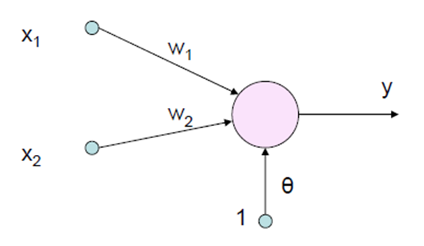

# API distribuido en Go

## Instrucciones de Uso

Para ejecutar el programa:
```bash
git clone https://github.com/CFSanchezV/DistributedGoAPI.git
cd DistributedGoAPI
# Crear n cantidad de nodos..
go run node.go
# Crear crear servidor..
go run server.go
```


## Dataset

El dataset utilizado se llama `mushroom-classification`. La versión completa del dataset original está disponible [Aquí](https://www.kaggle.com/uciml/mushroom-classification)

``` r
head(mushrooms)
#> # A tibble: 6 x 4
#>   Classes Cap_Shape Cap_Surface Odor Population Habitat
#> 1       p         x           s    p          s       u
#> 2       e         x           s    a          n       g
#> 3       e         b           s    l          n       m
#> 4       p         x           s    a          s       m
#> # … with 16 more variables
```

## Arquitectura



Un boceto de la red neuronal simple que consiste en una capa de entrada, una oculta y una de salida. La red recibe 22 entradas correspondientes a las características de un hongo. La salida es un valor binario que indica si el hongo es venenoso o no.


